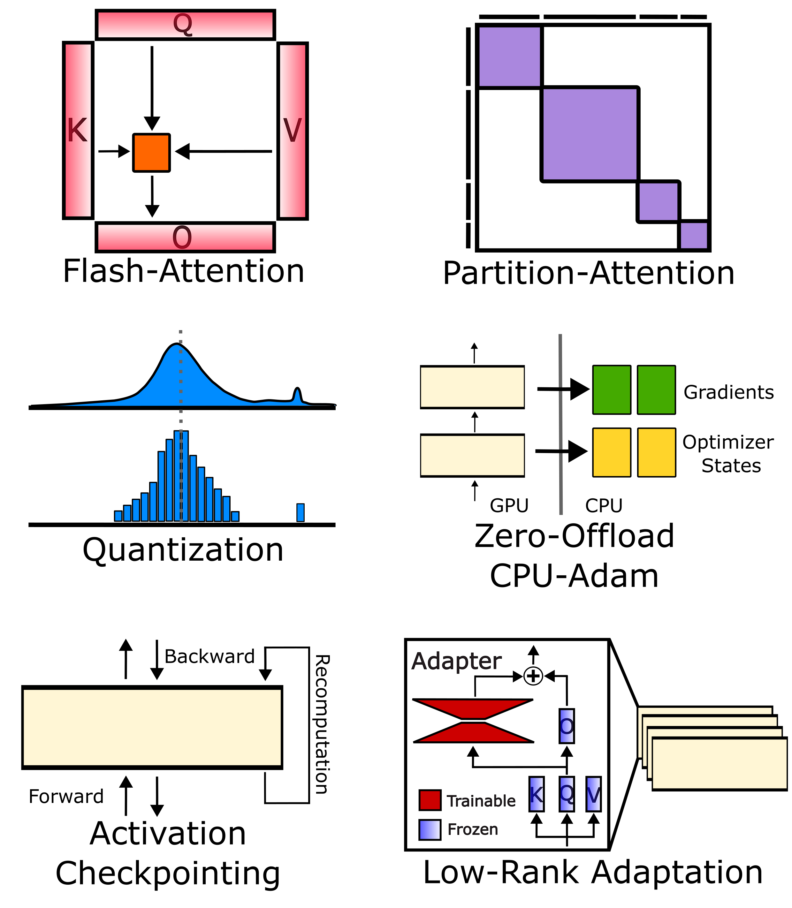
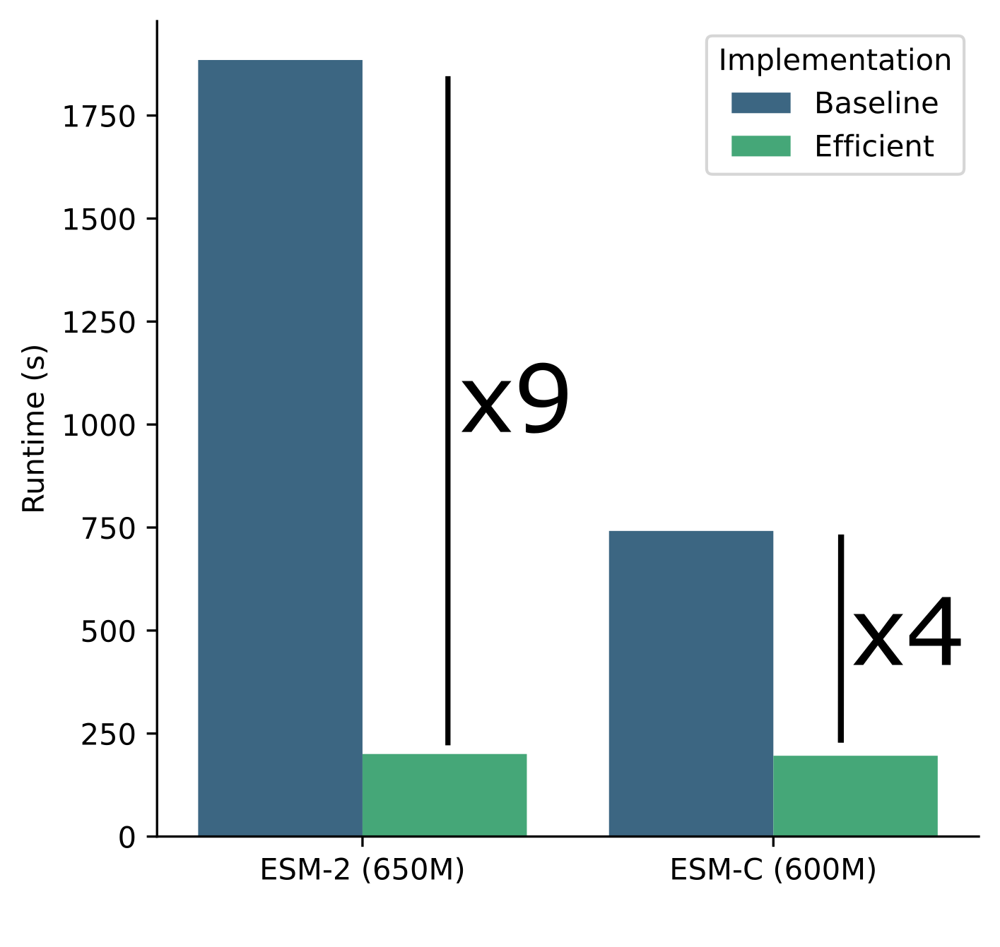

# ESM-Efficient 

Efficient implementatin of ESM family of models. Including ESM1b, ESM1v, ESM2, ESMC.

 

## Installation

Download the appropriate version of [pytorch](https://pytorch.org/get-started/locally/) and install it.
```
pip install flash-attn --no-build-isolation
pip install esm-efficient
```

## Basic Usage

```
from esme import ESM

model = ESM.from_pretrained('esmc') # or 'esm1b', 'esm1v', 'esm2', 'esm2_8m', ...
```
This will download the model weights from the HuggingFace model hub and load the model. [See doc from getting started]().

## Tokenization and Predicting Log Probabilities
Predict the log probabilities of a sequence of tokens using the model. 

```python
import torch
from esme import ESM2
from esme.alphabet import tokenize

# create load the model
model = ESM2.from_pretrained("{model}.safetensors", device=0)

tokens = tokenize(['MEEPQSDPSVEPPLSQESTFSLDLWK', 'MADQLTEEQIAEFKEAFSLFDKDG'])
tokens = tokens.to(0)

# predict logits
logits = model(tokens)
# logits.shape = (2, seq_len, embed_size)

# predict log probabilities
log_probs = model.predict_log_prob(tokens)
# log_probs.shape = (2, seq_len, embed_size)
```

## Tokenization without Padding
```python
from esme.alphabet import tokenize_unpad
# tokenize without padding (more efficient avoids calculating with padding)
tokens, indices, cu_lens, max_len = tokenize_unpad(['MEEPQSDPSVEPPLSQETFSDLWK', 'MADQLTEEQIAEFKEAFSLFDKDG'])
tokens = tokens.to(0)
cu_lens = cu_lens.to(0)
log_probs = model.predict_log_prob(tokens, (cu_lens, max_len))
# log_probs.shape = (seq_len_protein1 + seq_len_protein2, embed_size)
```

##  Predict effect of variants
```python

from esme.variant import predict_mask_margin

seq = 'MEEPQSDPSVEPPLSQETFSDLWK'
df = predict_mask_margin(model, seq)
# ... pd.DataFrame({
# ...    'variant': ['M1A', 'M1C', ..., 'P16Y'],
# ...    'score': [-0.1, -0.2, ..., -0.3]
# ... }).set_index('variant')
```

## Fine-tune the model with lora adapters:
```python

# only add will be trained by default
model.add_lora(rank=16, layers=('query', 'key', 'value'), adapter_names=['adapter1', 'adapter2'])

# mark only lora as trainable called by default when adding lora
model.mark_only_lora_as_trainable()

# save the model with the lora weights
model.save_lora('<path>.safetensors', adapter_names=['adapter1'])

# load the model with the lora weights
model.load_lora('<path>.safetensors')
```

## Quantization of the model:
```python
model = ESM2.from_pretrained('8M.safetensors', quantization='4bit', device=0)
```

Activation checkpointing of each transformer layer:
```python
model = ESM2.from_pretrained('8M.safetensors', checkpointing=True)
```

## Training the model

We provide pytorch lightning trainer for training the model. The following code trains the model with the masked language model objective:

```python
from esme import ESM2
from esme.data import MaskedFastaTokenDataModule
from esme.trainer import MaskedPLM

trainer = MaskedPLM(model) # pytorch lightning trainer
datamodule = MaskedFastaTokenDataModule(
    train_fasta='train.fasta',
    val_fasta='val.fasta',
    token_per_batch=50_000,
) # data module for training
trainer.fit(datamodule) 
```

# Model Weights

The model weights can be downloaded from the HuggingFace: [https://huggingface.co/mhcelik/esm-efficient/tree/main](https://huggingface.co/mhcelik/esm-efficient/tree/main)

# Evaluation 

To perform the evaluation reported in the paper, run the following command:

```bash
snakemake -n --use-conda
```

This will download the data, train the models, and evaluate them. The results will be saved in the `results` directory.
See the `workflow/Snakefile` for more details.

To generate a specific figures in the paper, run the following command:
```bash
snakemake reports/paper_figures/figure-2.pdf -n --use-conda 
```

# Citation
Manuscript for the efficient implementation: [https://www.biorxiv.org/content/10.1101/2024.10.22.619563v1](https://www.biorxiv.org/content/10.1101/2024.10.22.619563v1)
```bib
@article {Celik2024.10.22.619563,
    author = {Celik, Muhammed Hasan and Xie, Xiaohui},
    title = {Efficient Inference, Training, and Fine-tuning of Protein Language Models},
    elocation-id = {2024.10.22.619563},
    year = {2024},
    doi = {10.1101/2024.10.22.619563},
    publisher = {Cold Spring Harbor Laboratory},
    URL = {https://www.biorxiv.org/content/early/2024/10/25/2024.10.22.619563},
    eprint = {https://www.biorxiv.org/content/early/2024/10/25/2024.10.22.619563.full.pdf},
    journal = {bioRxiv}
}
```
Also, cite original ESM papers for the related model: [https://github.com/facebookresearch/esm](https://github.com/facebookresearch/esm)
